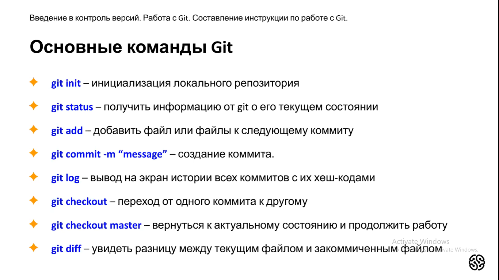

# Instruction Markdown
# Заголвок 
## Подзаголовок

*Курсив*

**жирный текст**
* Ненумерованный список 1
* Ненеумерованный список 2
+ hgbg

1. Нумерованный список 1
2. Нумерованный список 2
## Работа с изо
