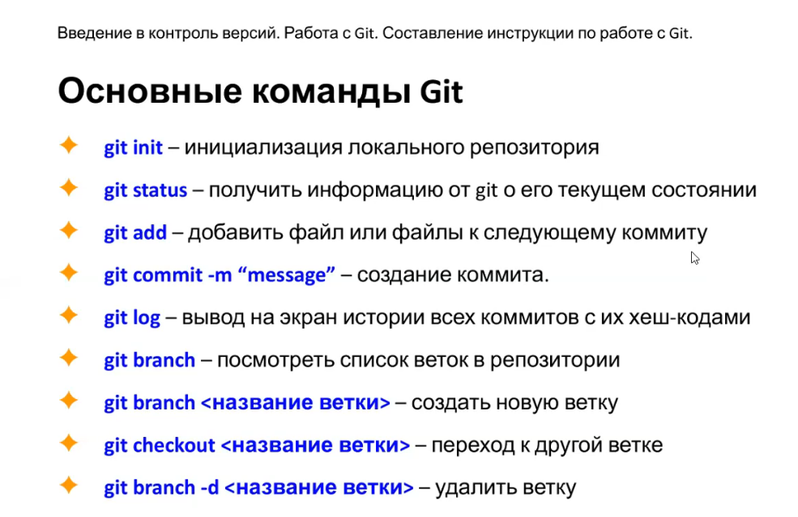

# Most used command Git
## Begin (1 lession):
1. git int **- initialize local folder as repo**
2. git add **- get file(s) to next commit**
3. git commit -m "name" **- create commit**

## Work with Github
1. git clone url_github **- copy code_https_url from github ang create repo**
2. git remote add origin url **- set url to upload**
3. git branch -M master **- set needed branch as master**
4. git puch -u origin master **- uploag to github local repo (master branch) (maybe need input log/pass)**
5. git pool **- download and merge remote actual repo**
 
## Also need next command:
* git log **- show history  all commits with hash**
* git checkout number **- change commits**
* git checkout master **- back to actual and continue work**
* git diff **- show differents between actual and last commited files**
* git commit --amend -m "..." **- replase last commit to new**
* git commit -am **- set commit to all files in repo**

## Branches
1. git branch **- see all branches an current**
2. git branch name **-add new branch winh name**
3. git checkout -b name **-add new (-b) branch with name, and switch on it**
* git merge name **- merge branch name with current branch, also i can merge more, than 1 branch ex. git checkout edit image ...**
* git branch -d name **- (-d) delete name branch**
* git merge --abort **- abort previous merge**
* !!! when work on some branch the all saved files or changes was hidden, and be showed when i again change branch

## Rebase:
1. git log --oneline **-see all commits**
2. git rebase -i <commit_number> **- edit selected commit**
* in commit_editmsg i can edit data

## work with files via TERMINAL
* touch name **- create new file in repo**
* echo "text" > Name_file **-add text "text to file Name_file**
* mkdir name **- create folder reserve**
* cd .. **- folder up**
* rm -R name **- delete file/folder**